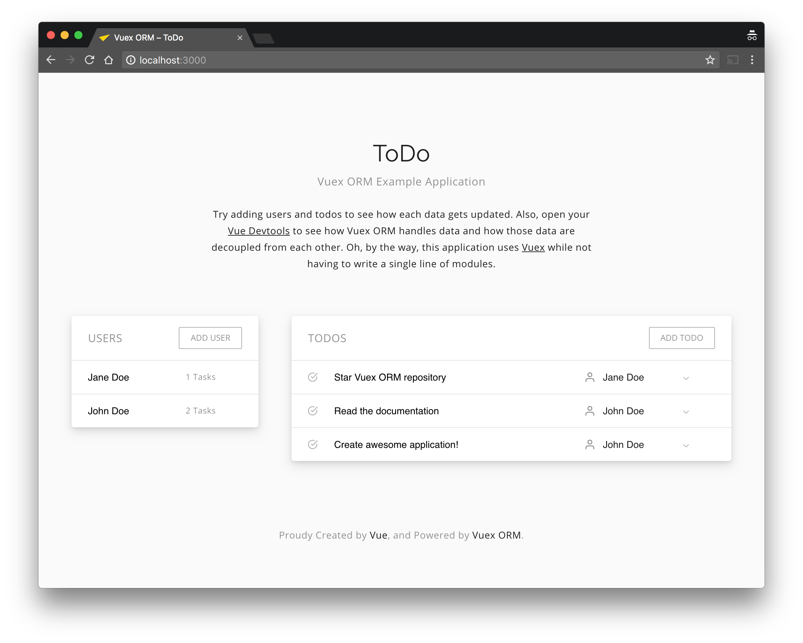

# Vuex ORM Next Examples

The example application to demonstrate the use case of the [Vuex ORM Next](https://next.vuex-orm.org). It's a simple ToDo application which can add assignee to each todo. You can see how Vuex ORM Next connects those two models – Todo and Assignee – and how to create, edit and delete them.



## Running The Example

Clone this repository and then run following commands.

```bash
$ npm install
$ npm run dev

# Or with yarn.

$ yarn install
$ yarn dev
```

Then you can access http://127.0.0.1:5173 to play with the app!

## Contribution

If you have any idea to make this example application easier to understand to people who are new to the Vuex ORM Next, please open an issue, or pull request :tada:
